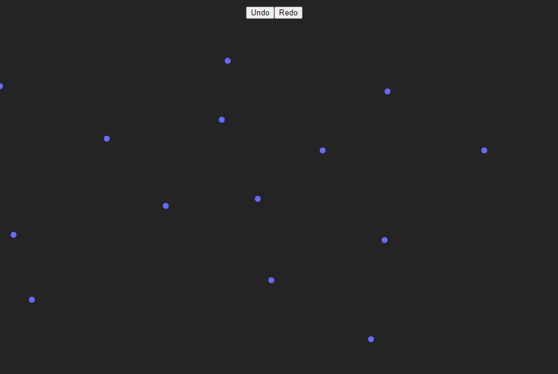

# ReactJS Dots Junior/Intermediate Challenge by The Dev Environment 

It was a fun little project to do, this is my solution. 

[!Doing a React Coding Challenge! (Junior/Intermediate) w/ Typescript](https://www.youtube.com/watch?v=D36HU7LpTCk) 

[!The Dev Environment channel](https://www.youtube.com/@thedevenvironment)

# Built With ViteJS

## Installation

1. Clone the repository 
git clone https://github.com/AndresAltv/Dots-challenge.git  

2. Install dependencies 
npm install  

3. Start server 
npm run dev
